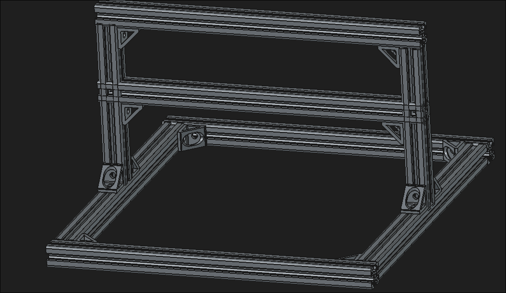

# May 24th, 2026: started work on a prelimnary design for the cnc machine
start time 14:45
got startred on designing a inishal version of a frame for the cnc machine in freecad.

**time spent: 45min**

# May 24th, 2026: did some research and started redesinging the frame

did some research into what size of aluminum extrusion i need to use for this project and settled on using 4040 extrusion for the frame and Z gantry. i also started remaking the cad model using ther larger 4040 extrusion.

**Time Spent: 2hr**
